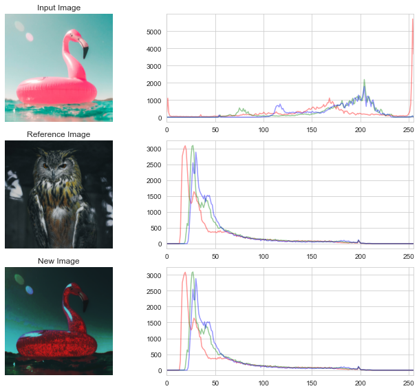

# Exact Histogram Specification

This is a Python implementation of **Exact Histogram Specification** by *Dinu Coltuc et al.*

Pixel intensities are discrete values in a range defined by the image bit depth.

Classic histogram matching algorithms can only approximate a specified histogram.
This is because all pixels of an intensity value need to be transformed to another intensity value.

Exact histogram matching is a solution to this problem.
It is solved in a k-dimensional space, where cumulative distribution functions are created, and pixel values are then separated into classes and assigned an intensity value.
Basically, a pixel is sorted, evaluated and changed not only by it's value, but the average value of several neighborhoods.
This strict ordering is similar to the natural ordering, this preserving image content.

More information can be found in the [original paper](https://doi.org/10.1109/TIP.2005.864170), which describes the algorithm more concise.

```plain
D. Coltuc, P. Bolon, and J.-M. Chassery, “Exact histogram specification,” IEEE Trans. on Image Process., vol. 15, no. 5, pp. 1143–1152, May 2006, doi: 10.1109/TIP.2005.864170. [Online]. Available: http://ieeexplore.ieee.org/document/1621236/. [Accessed: Jan. 30, 2022]
```

## Code Attribution

Python implementation by:  
`StefanoD`,  
[https://github.com/StefanoD/ExactHistogramSpecification](https://github.com/StefanoD/ExactHistogramSpecification),  
Apache License Version 2.0

Here reorganized as a Python package for quick install.  
Also includes a small and spurious [validation step](doc/validate.py) and changes to this ReadMe file.

## Validation



[See doc/validate.py for details on this plot](doc/validate.py)

## Installation Instructions

Using pip:

```bash
pip install git+https://github.com/jkschluesener/ExactHistogramSpecification
```

## Usage

```python
from histogram_matching import ExactHistogramMatcher # This package
from PIL import Image # or use your preferred way of reading image data

# Load images
reference_image = np.array(Image('doc/image_a.jpg'))
input_image = np.array(Image('doc/image_b.jpg'))

# Get reference histogram
reference_histogram = ExactHistogramMatcher.get_histogram(reference_img)
# Match input image to reference histogram
new_image = ExactHistogramMatcher.match_image_to_histogram(input_image, reference_histogram)

```

See [doc/validate.py](doc/validate.py) for an example going more into detail and displaying results.

You can specify the image bit depth and number of kernels to use for the histogram match.
Please see the code docstrings, which are very helpful.
